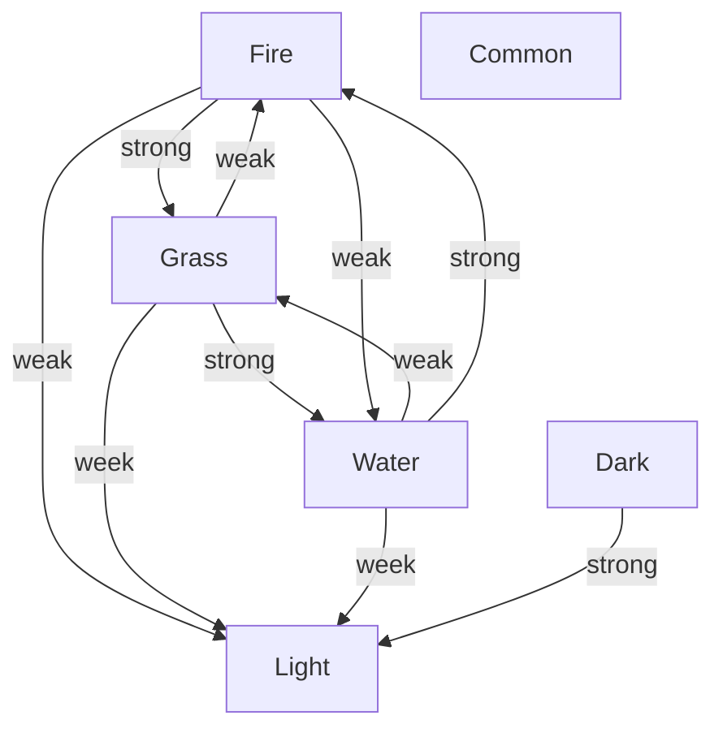

# CTA

The Textual Advantual Game written in C.

## Basic Element

Easy to config, all the config is text
and can be found under `CONF` folder.

### Character

The most important element of this game is the main character,
someone may call him/her the hero/heroine, whatever.

All state of a character list after

```c
typedef struct GameState {
  char name[MAX_STR_LENGTH];
  size_t hp;
  size_t hpBound;
  Weapon wp;
  Bag bag;
  Buff buff;
  size_t coin;
  size_t step;
  size_t state;
} GameState;
```

- the name will input by user at first time, then will load from config
- the weapon by default is `punch (0)`, can be modified in config
- the buff will not work when the character not in the fight
- while the buff do not work, the time of the buff will still go on
- the state can be 0, 1, 2 and 3
  - 0: the normal mode
  - 1: the fight mode
  - 2: the bag mode
  - 3: the shop mode

### Monsters

#### Types

monster have 6 types

- fire
- grass
- water
- common
- light
- dark

the relation of these types is



### Place

Every time you enter this game,
your time and place will be setted randomly.

```c
srand(time(NULL));                // srand
GameTP[0] = rand() % 50;          // time
GameTP[2] = rand() % AllCount[1]; // place
```

#### Poison

You can get poison by walk around.

The effect of the posion is random (heal).

#### Time

A day, include day and night, can be counted as 50 prs.

That means you do 50 processes, a day passed.

30 prs is day, and 20 prs is night.

#### Envrionment

Place have some specific monsters,
and it also have type, same as monster.

The type of place can give monster a buff,
independent to the relation of the types.

```c
typedef struct Place {
  char name[MAX_STR_LENGTH];
  size_t monsterTypes;
  size_t monsters[MAX_ITEM_COUNT];
  size_t type;
  size_t range;
} Place;
```

### Shop

You can easily use `$` in normal mode
to open game store.

#### Weapon

You can buy weapons in shop.

```c
typedef struct Weapon {
  char name[MAX_STR_LENGTH];
  size_t damage;
  size_t type;
} Weapon;
```

All the weapon can be configed.
