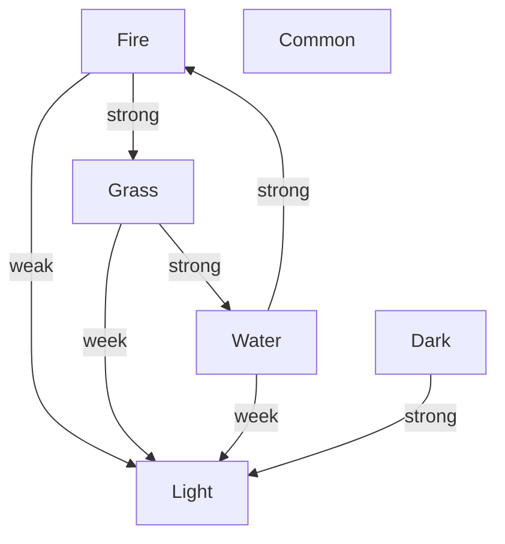

# CTA

The Textual Advantual Game written by C.

## Basic Element

### Character

The most important element of this game is the main character,
someone may call him/her the hero/heroine, whatever.

**_TODO_**

### Monsters

#### Types

monster have 5 types

- fire
- grass
- water
- common
- light
- dark

the relation of these types is

### Place

#### Time

A day, include day and night, can be counted as 50 prs.

That means you do 50 processes, a day passed.

30 prs is day, and 20 prs is night.

#### Envrionment

### Shop

#### Poison

#### Weapon
